基于SpringBoot的毕业就业信息管理系统（程序+论文）
=
- 完整代码获取地址：从戎源码网 ([https://armycodes.com/](https://armycodes.com/))
- 作者微信：19941326836  QQ：952045282 
- 承接计算机毕业设计、Java毕业设计、Python毕业设计、深度学习、机器学习
- 选题+开题报告+任务书+程序定制+安装调试+论文+答辩ppt 一条龙服务
- 所有选题地址https://github.com/nature924/allProject

一、项目介绍
---
基于Spring Boot框架实现的毕业就业信息管理系统，系统包含三种角色：管理员、公司、用户,系统分为前台和后台两大模块，主要功能如下。
### 前台：

首页：展示毕业就业信息管理平台的相关内容。
公司：浏览和搜索招聘公司的信息。
简历：学生上传和管理自己的简历，进行简历投递。
公告信息：查看和发布最新的就业相关公告信息。
职位招聘：浏览和搜索最新的职位招聘信息。
个人中心：管理个人信息和简历。

### 后台（管理员）：

个人中心：管理个人信息。
管理员管理：管理其他管理员账号的信息。
基础数据管理：管理系统中的基础数据，
公司管理：管理招聘公司的信息，
简历管理：管理学生上传的简历信息，
就业统计管理：统计毕业生的就业情况。
公告信息管理：发布和管理最新的就业相关公告信息。
简历投递管理：管理简历投递情况，
学生管理：管理学生账号信息，
职位招聘管理：管理职位招聘信息，
轮播图信息：管理系统的轮播图信息，
### 用户：

个人中心：管理个人信息和简历。
简历管理：上传和管理个人的简历信息。
就业统计管理：查看和更新个人的就业情况。
公告信息管理：查看最新的就业相关公告信息。
简历投递管理：查看个人简历投递情况和审核进度。
职位招聘管理：查看和申请最新的职位招聘信息。

二、项目技术
---
- 编程语言：Java
- 数据库：MySQL
- 项目管理工具：Maven
- 前端技术：VUE、HTML、Jquery、Bootstrap
- 后端技术：Spring、SpringMVC、MyBatis

三、运行环境
---
- 操作系统：Windows、macOS都可以
- JDK版本：JDK1.8以上都可以
- 开发工具：IDEA、Ecplise、Myecplise都可以
- 数据库: MySQL5.7以上都可以
- Tomcat：任意版本都可以
- Maven：任意版本都可以

四、运行截图
---
### 论文截图：
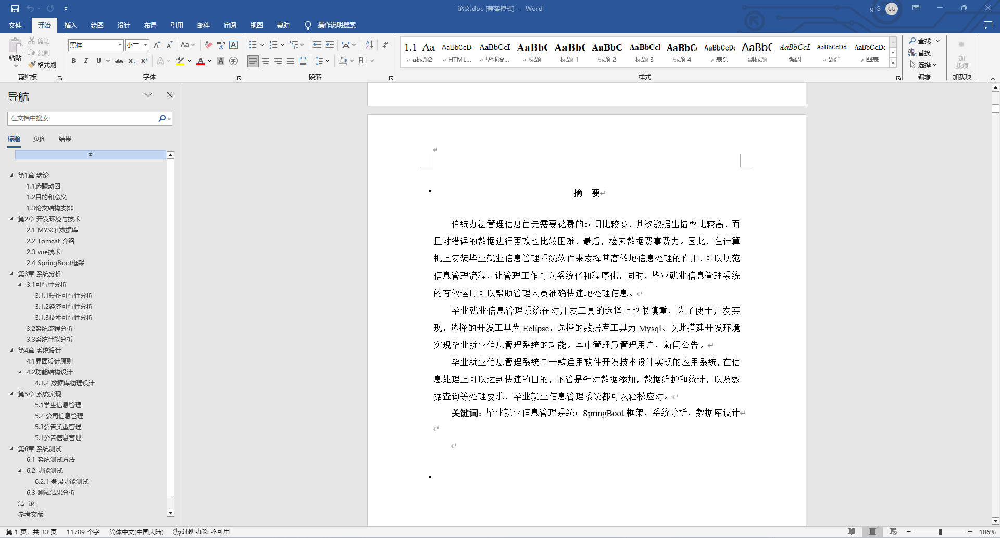
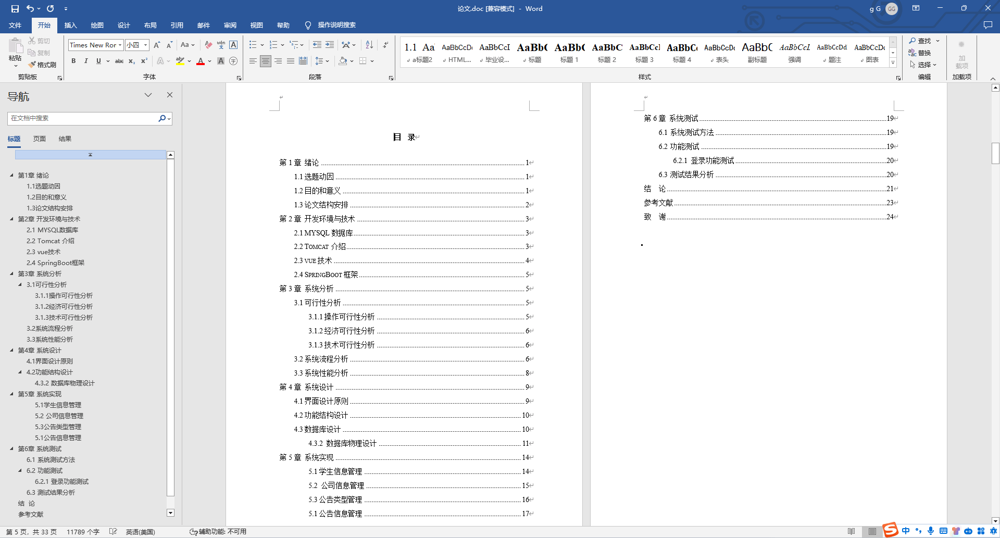

### 程序截图：
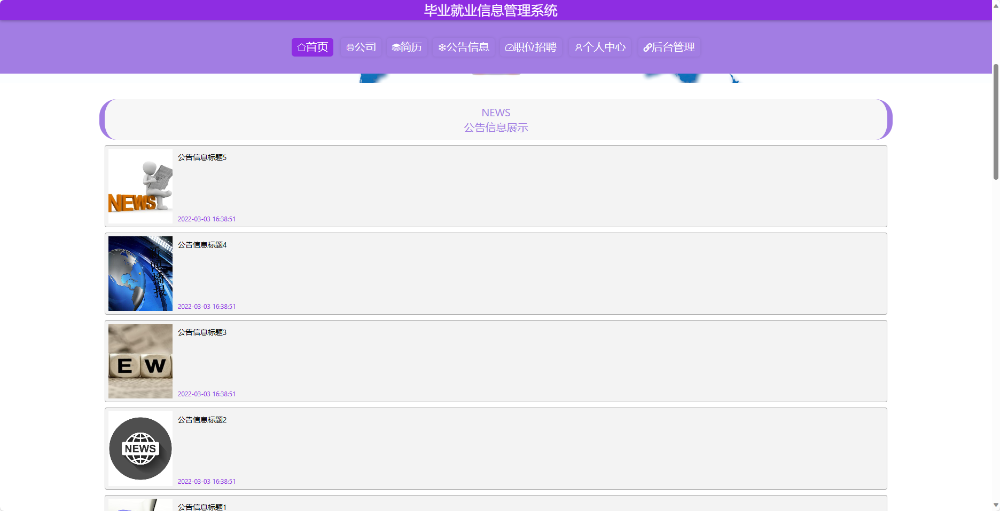
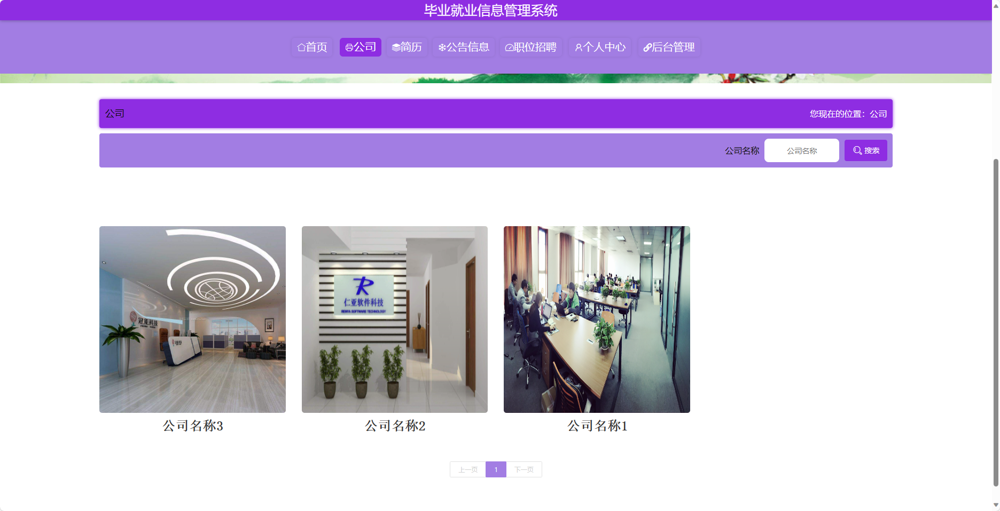
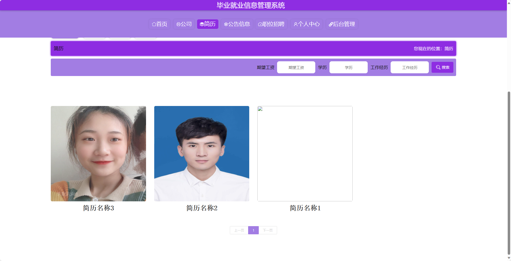
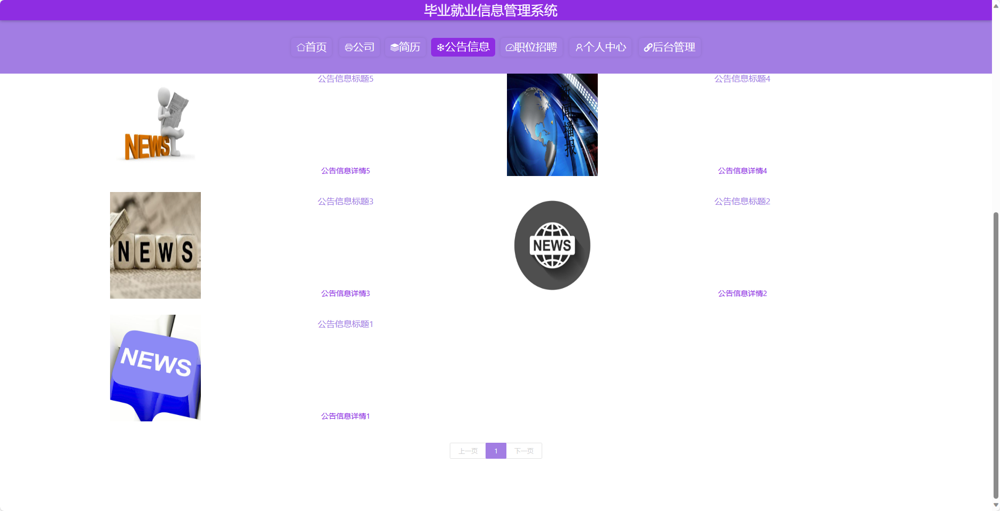
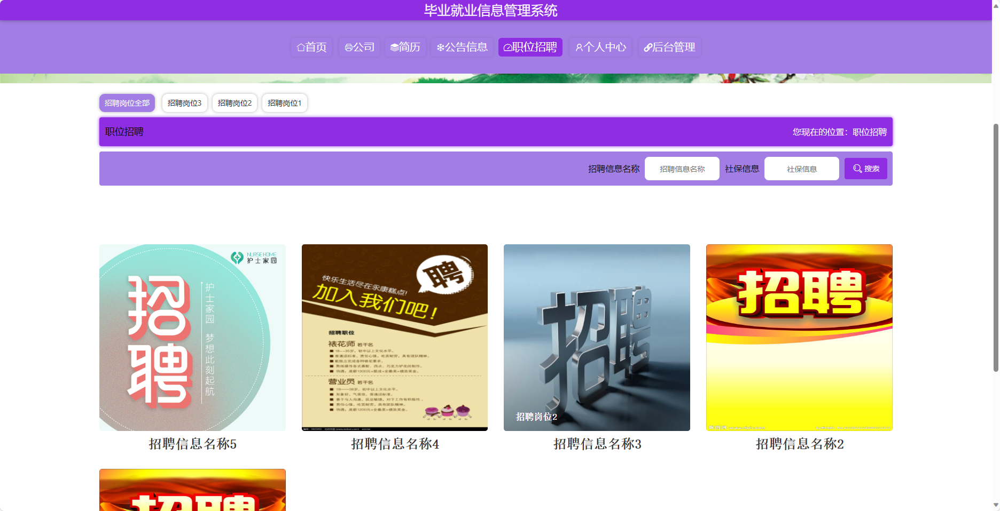
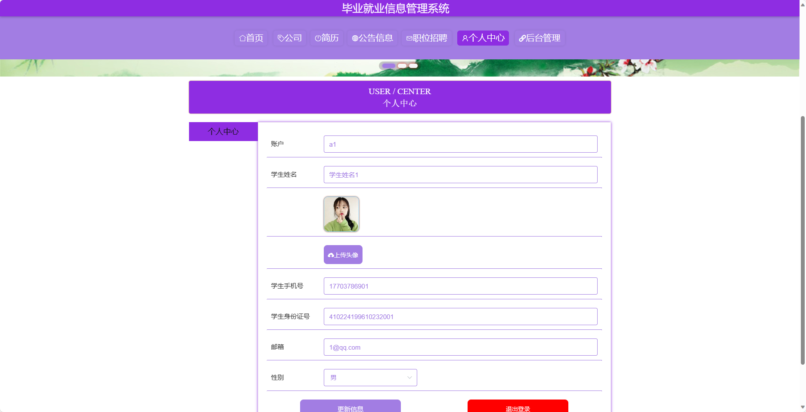
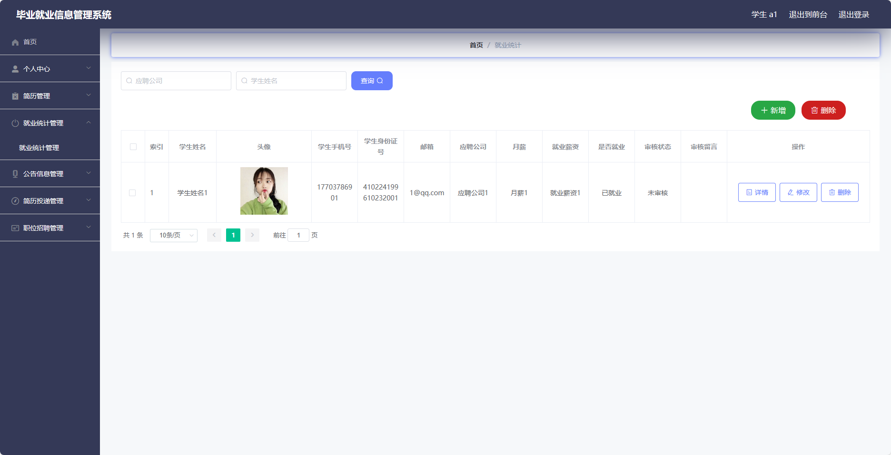
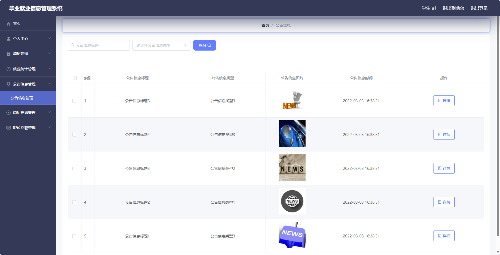
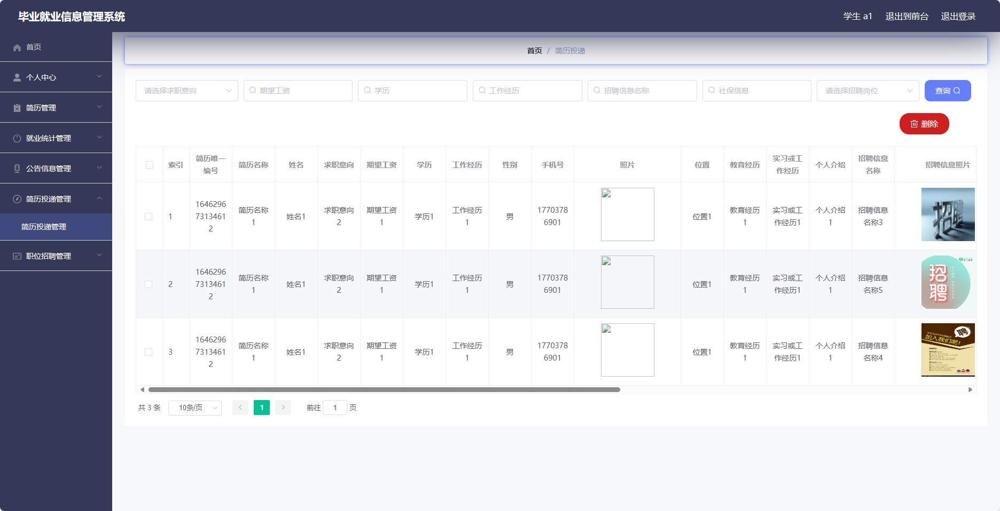
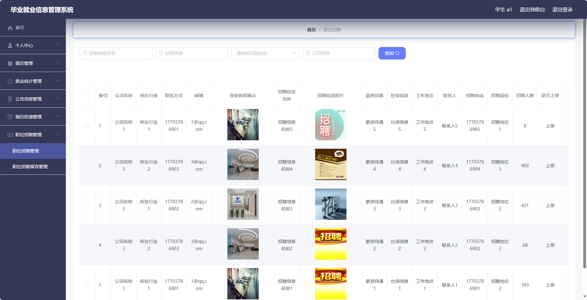

